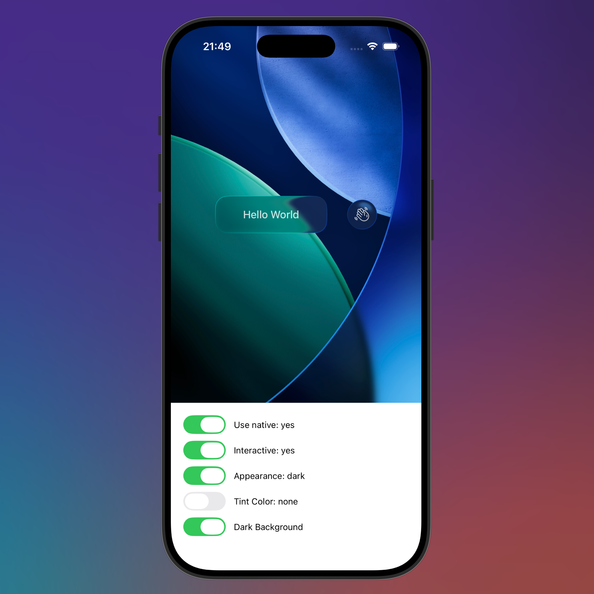

# react-native-glass-effect-view

A native liquid glass view for iOS, with fallbacks for older versions and Android.



## Installation

```sh
npm install react-native-glass-effect-view
```

Make sure to rebuild your project after installing the package. On iOS, your project will
only build successfully on Xcode 26 or newer.

## Usage

```js
import { Text } from "react-native";
import { GlassEffectView } from "react-native-glass-effect-view";

// ...

<GlassEffectView isInteractive>
  <Text>Hello world!</Text>
</GlassEffectView>;
```

## Props

| Prop            | Type                                 | Description                                                                                                       |
| --------------- | ------------------------------------ | ----------------------------------------------------------------------------------------------------------------- |
| `isInteractive` | `boolean`                            | Makes the glass effect more prominent with enhanced shadow effects when `true`                                    |
| `appearance`    | `"light"` \| `"dark"` \| `"default"` | Controls the visual appearance of the glass effect. `"default"` follows the system color scheme                   |
| `useNative`     | `boolean`                            | Whether to use the native iOS implementation when available (iOS 26+). Set to `false` to force fallback rendering |
| `tintColor`     | `string`                             | Custom background color for the glass effect. When provided, overrides the default appearance-based background    |
| `style`         | `ViewStyle`                          | Standard React Native style prop for positioning, sizing, and layout                                              |
| `children`      | `ReactNode`                          | Content to display inside the glass effect view                                                                   |

### Additional Notes

- All standard `ViewProps` are supported (e.g., `testID`, `accessibilityLabel`, etc).
- On iOS 26+, the native glass effect implementation is used by default.
- On older iOS versions and Android, a fallback implementation provides a similar visual effect.
- The fallback implementation uses CSS-style shadows and background blur effects. It's nowhere near as cool, but it should serve as a decent fallback.


<br /><br />

---

<div align="center">
	<b>
		<a href="https://schof.co/consulting/?utm_source=react-native-glass-effect-view">Get professional support for this package →</a>
	</b>
	<br>
	<sub>
		Custom consulting sessions available for implementation support or feature development.
	</sub>
</div>
